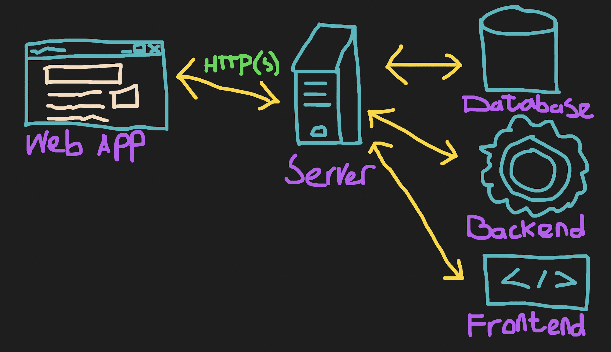

# Web application Hacking
A web application is an application that is hosted on a webserver which could be communicated with through the HTTP(S)-protocol.
A complete web application consists of a frontend, backend and a database.

This section will inform you on how you could use some tools to hack a web application.

## Navigation
Select a directory to read more about the tooling and with some code snippets you could use.

