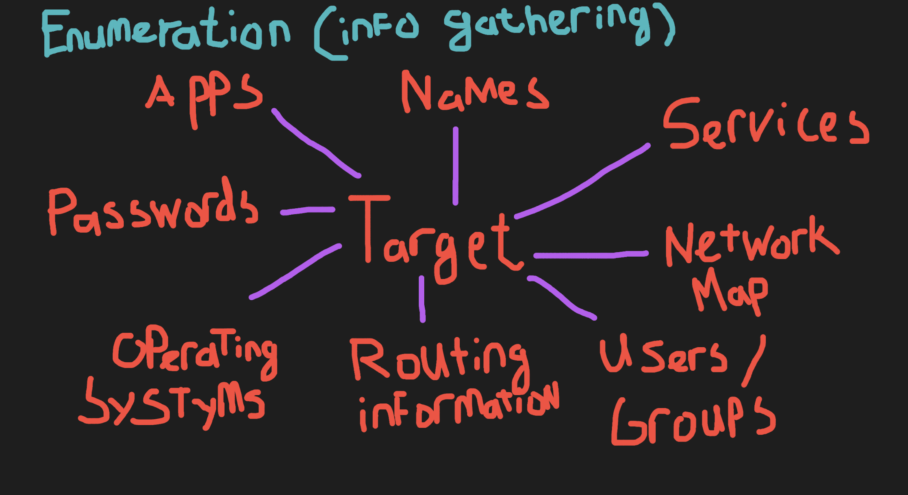

# Enumeration
Enumeration is the first phase of Ethical Hacking. In this phase you will be gathering as much information as possible about the system. 
With this information the hacker could identify the possible vulnerabilities or weak points in the system which could be exploited in a later phase.

